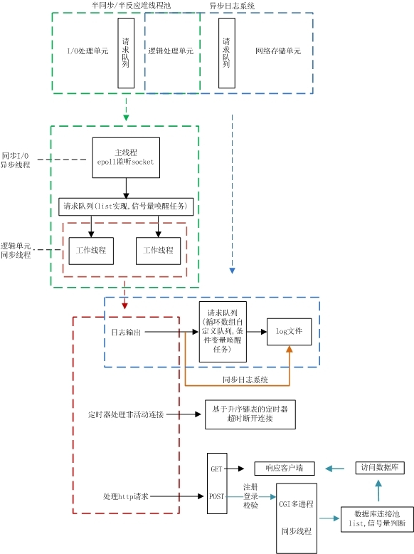
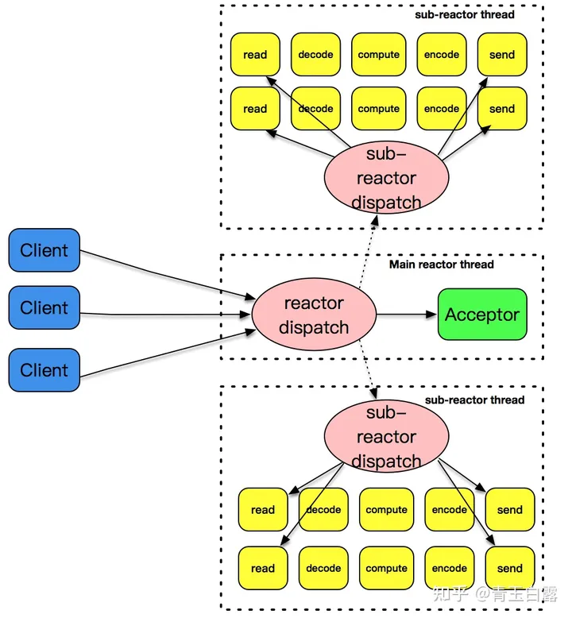
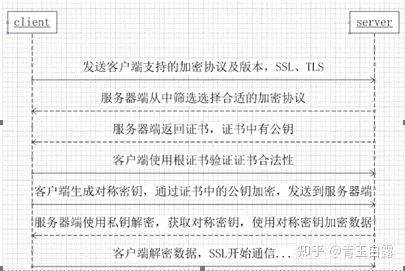

> 前言-项目背景：
>
> 本科的时候想到虽然天天上网，但实际上对信息、数据在整个网络中的传输、交换流程其实不算清楚，所学的很多知识也都是最底层的物理层的信号处理原理，比如调制解调、信道编译码等等。所以后面
>
> * 一方面借着一门实验课的机会自学了计算机网络，然后用实验室的交换机、路由器搭建了一个简易校园网络（接入层、汇聚层、核心层；防火墙、web/DNS/ftp应用、路由协议OSPF、DHCP、NAT等）
> * 另一方面，为了练习C++编程和熟悉Linux操作，同时也是好奇web服务器实际是如何处理我们浏览器发出的一系列请求，所以就想要学习一下web服务器的整体框架和具体处理是如何实现的。
> * 所以先是看了游双的《Linux高性能服务器编程》，了解了Linux网络编程所需要掌握的相关内容，包括服务器的一般组成模块、同步/异步-I/O模型、Reactor/Proactor事件处理模式、常用的并发处理模式和多进程/多线程并发编程等。
> * 然后再在Github上找到了适合入门的的webserver开源实现代码，跟着一步步完成了整个项目的开发、测试和文档的总结。

# 一、项目基本框架及相关技术

## 1.1 项目概述

Linux环境下基于C++的轻量级web服务器开发，用于C++编程练习及网络编程入门学习。实现功能及框架如下：

* 基于 **线程池、非阻塞socket + epoll I/O复用(LT/ET可选)、事件处理(Reactor/模拟Proactor可选)** 实现并发处理模型
* 基于**主从状态机**实现http请求解析，支持**GET**和**POST**请求
* 基于mysql**数据库连接池**实现web端用户**注册、登录**功能，可请求服务器**图片和视频**文件，支持**大文件**传输
* 实现**同步/异步日志系统**，记录服务器运行状态
* 经Webbench压力测试可以实现**上万的并发连接**数据交换

## 1.2 系统架构及功能解析



### 1.2.1 <font color='grenn'>**I/O处理单元**</font>

* 功能：处理用户连接，读写网络数据（如读http请求，写http响应）

* **I/O模型** —— `非阻塞socket + epoll I/O复用`：描述服务器对socket的监听和读写机制

  * 应用程序通过 I/O复用函数（`select/poll/epoll_wait`） “向内核注册一组事件”（如用户连接事件），内核通过 I/O复用函数 把其中就绪的事件（有用户请求到达）通知给应用程序。

  * 注：I/O复用函数本身阻塞，而对I/O操作本身是非阻塞的，从而可以同时监听多个I/O事件，提高效率。

  * **epoll的触发模式** —— 监听socket `listenfd`和连接socket `connfd`可以设置不同的触发模式

    - [x] `电平触发(LT)`

      > 当epoll_wait检测到其上有事件发生并将此事件通知应用程序后，应用程序可以不立即处理该事件。这样，当应用程序下一次调用epoll_wait时，epoll_wait还会再次向应用程序通告此事件，直到该事件被处理。

    - [x] `边沿触发(ET)` —— 高效的epoll工作模式

      > 当epoll_wait检测到其上有事件发生并将此事件通知应用程序后，应用程序必须立即处理该事件，因为后续的epoll_wait调用将不再向应用程序通知这一事件。

      * `EPOLLONESHOT事件`：用于保证一个连接socket在任一时刻都只被一个线程处理，保证连接的完整性，降低资源管理复杂度。

        > 1. 监听socket `listenfd`不能注册`EPOLLONESHOT事件`，否则否则应用程序 只能处理一个客户连接！因为后续的客户连接请求将不再触发监听socket `listenfd`上的`EPOLLIN`事件
        >    * 注：服务器只监听与给定ip和port绑定的某个`listenfd`，客户端根据对应的ip和port去申请连接，当服务器发现有客户连接，则为客户分配一个连接socket `connfd`，用于业务处理。
        > 2. 连接socket  `connfd`每次处理完该连接上的数据，需要重新注册`EPOLLONESHOT事件`，否则该连接无法再次被触发并处理

* **并发模式** —— `半同步半反应堆`：I/O处理单元和多个逻辑单元之间协调完成任务的方法

  * 半同步半反应堆是一种半同步半异步并发模式，由主线程作为异步线程处理I/O事件，工作线程作为同步线程处理业务请求。
  * 同步：程序完全按照代码序列的顺序执行
  * 异步：程序的执行由系统事件驱动（如信号）

* **事件处理模式** —— 描述主线程和工作线程的分工

  - [x] `Reactor模式`。主线程只负责监听文件描述符`fd`上是否有事件发生，读写数据、接受新连接和处理客户请求由逻辑单元/工作线程完成。**向工作线程通知 “I/O就绪事件” **。
  - [x] `同步I/O模拟的Proactor模式`。主线程及内核负责所有I/O操作，工作线程只负责处理客户请求。**向工作线程通知 “I/O完成事件” **。

* **线程池**

  * 原理：池是一组资源的集合，这组资源在服务器启动之初就被完全创建好并初始化，这称为静态资源分配。当服务器进入正式运行阶段，即开始处理客户请求的时候，如果它需要相关的资源，就可以直接从池中获取，无须动态分配（从池中获取资源比动态分配速度快读多）。处理完一个客户请求，将该资源放回池中，无需释放资源，从而避免了对内核的频繁访问，提高了效率。
  * 本质：以空间换时间：通过服务器的硬件资源，换取运行效率。

### 1.2.2 <font color='grenn'>**逻辑处理单元**</font>

* 三大功能：处理业务请求（http）、基于定时器处理非活动连接、打印系统日志

* **处理http请求**

  * **状态机** —— 高效的逻辑处理方式：实现GET和POST请求解析和处理

    * 实现机制：应用层协议头部包含数据包类型字段，每种类型可以映射为逻辑单元的一种执行状态，服务器可以根据它来编写相应的处理逻辑，在不同的执行状态间进行跳转

    * 实现方式：`主状态机` + `从状态机`

      > * `主状态机`：http请求报文解析状态——解析请求行、解析请求头、解析请求主体
      > * `从状态机`：报文每行的解析状态——LINE_OPEN(未读取到完整行)、LINE_OK(读取完成)、LINE_BAD(行语法错误)

  * **数据库连接池**：实现用户注册和登录校验（注意这里其实删除了CGI校验方式）

    * 单例模式
    * 数据库连接池的RAII实现：RAII-资源获取即初始化，通过一个类的构造函数和析构函数分别封装数据库连接的取用和释放，实现对资源的自动管理。

* **定时器处理非活动连接**

  * 超时时间：记录每条连接超时的绝对时间

  * 定时器容器：升序链表（也可以用小根堆或其它数据结构实现，以提高效率）

  * 实现方式：

    * 概述：利用`alarm`函数周期性地触发`SIGALRM`信号，信号处理函数利用**管道`pipe`**通知主循环，主循环接收到该信号后对升序链表上所有定时器进行处理，若该段时间内没有交换数据，则将该连接关闭，释放所占用的资源。

    * **统一事件源**  —— 将信号事件和其它事件一样被处理

      > * 信号处理函数使用管道将信号传递给主循环，信号处理函数往管道的写端写入信号值（信号处理函数仅发送信号通知主循环，由主循环执行信号对应的逻辑代码，减少信号处理函数执行时间，防止信号被屏蔽太久 —— 被屏蔽太久会导致什么问题？
      > * 主循环则从**管道**的读端读出信号值，使用**I/O复用系统调用来监听**管道读端的可读事件，这样**信号事件与其他文件描述符都可以通过epoll来监测**，从而实现统一处理。

* **日志系统**

  * [x] **同步写入**

    > 日志写入函数与工作线程串行执行，由于涉及到I/O操作，**当单条日志比较大的时候，同步模式会阻塞整个处理流程**，服务器所能处理的并发能力将有所下降，尤其是在峰值的时候，写日志可能成为系统的瓶颈。

  * [x] **异步写入**

    > * 基于生产者-消费者模型：生产者线程与消费者线程共享一个缓冲区，其中生产者线程往缓冲区中push消息，消费者线程从缓冲区中pop消息。
    > * 实现方式：
    >   * **阻塞队列**（即请求队列）：将生产者-消费者模型进行封装，使用**循环数组**实现队列（或直接用STL的queue容器，但也需要封装），作为两者共享的缓冲区
    >   * **异步日志**：将所写的日志内容先存入阻塞队列，写线程从阻塞队列中取出内容，写入日志

### 1.2.3 <font color='grenn'>**网络存储单元**</font>

* 数据库连接池 —— **单例模式**
* 日志文件 —— **单例模式**

### 1.2.4 <font color='grenn'>**请求队列**</font>

* 功能：各单元之间的通信方式的抽象。
* 主线程与工作线程之间的请求队列 —— 基于链表实现
* 日志缓存与写日志文件操作之间的请求队列 —— 基于循环数组实现（阻塞队列）

## 1.3 webserver工作流程梳理

* **服务器启动**——`main.cpp`

  > * 设置服务器使用的数据库用户名、密码、数据库名称
  >
  > * 解析命令行，获取服务器启动的模式设置（包括端口号、事件处理模式Reactor/Proactor、listenfd和connfd的触发模式LT/ET、日志系统同步/异步写入模式、数据库连接池以及线程池中的最大连接数量等）——`config.parse_arg();`
  >
  > * 实例化Webserver对象（服务器对象）——`WebServer server;`
  >
  >   > 构造函数初始化资源文件夹root路径，并为`http_conn`对象和定时器对象`users_timer`动态申请内存空间。
  >
  > * 服务器初始化
  >
  >   * 利用解析得到的参数及默认配置参数初始化服务器——`server.init();`
  >
  >   * 日志系统初始化
  >
  >     > 开启/关闭日志系统，并设置同步/异步写入模式。
  >
  >   * 数据库连接池初始化
  >
  >     > 生成Maxconn条数据库连接，并将信号量的值初始化为最大连接次数（信号量用于通知是否存在可用数据库连接）。
  >
  >   * 线程池初始化
  >
  >     > 初始化http_conn类型的线程池，通过构造函数`threadpool()`循环创建`thread_number`条工作线程，并利用`pthread_detach()`分离工作线程，从而不用单独回收，由程序结束后自动释放资源
  >
  >   * 触发模式设置
  >
  >     > listenfd和connfd的触发模式LT/ET组合。
  >     >
  >     > <font color='red'>问题：LT和ET模式有什么区别？如何影响服务器的工作效率？</font>
  >     >
  >     > <font color='grenn'>答</font>
  >     >
  >     > 1. LT：当epoll_wait检测到其上有事件发生并将此事件通知应用程序后，应用程序可以不立即处理该事件。这样，当应用程序下一次调用epoll_wait时，epoll_wait还会再次向应用程序通告此事件，直到该事件被处理
  >     > 2. ET：当epoll_wait检测到其上有事件发生并将此事件通知应用 程序后，应用程序必须立即处理该事件，因为后续的epoll_wait调用将 不再向应用程序通知这一事件
  >     > 3. 对比：
  >     >    * 实现上的区别——<font color='red'>监听socket listenfd，没搞明白有什么区别？</font>
  >     >      * LT是每次检测到读事件就调用一次`accept()`从监听队列取出数据，但有可能获取失败？
  >     >      * ET是通过`while(1)`阻塞，直到通过`accept()`从监听队列中取出了一个连接socket
  >     >      * 感觉对于监听socket来说，似乎区别不大？
  >     >    * 实现上的区别——连接socket connfd，以Proactor为例
  >     >      * LT是调用一次`read_once()`读取数据，然后等待下一次工作线程竞争到该任务对象，再继续读取数据
  >     >      * ET是由主线程通过循环调用`read_once()`一次性将socket上的数据读取完
  >     >    * ET模式大大降低了一个epoll事件被重复触发的次数，可以提高服务器效率。
  >
  > * 服务器开始监听用户连接——`server.eventListen();`
  >
  >   > 监听用户连接的基本步骤：
  >   >
  >   > 1. 创建socket——`socket();`
  >   > 2. socket命名，并绑定socket地址——`bind();`将定义的socket地址分配给监听socket listenfd
  >   > 3. 创建socket监听队列以存放待处理的客户连接——`listen(listenfd, backlog);`用户会向socket listenfd申请连接，backlog表示处于完全连接状态ESTABLISH的连接数量上限（全连接队列长度）
  >   > 4. 创建epoll内核事件表——`epollfd = epoll_create();`内核事件表的统一文件描述符epollfd
  >   >    * 向内核事件表注册监听socket listenfd的读事件
  >   >    * 向内核事件表注册用于超时事件处理的读事件，监听管道的读端
  >
  > * 服务器开始运行（主线程）——`server.eventLoop();`
  >
  >   > 循环运行事件检测和事件处理程序，直到服务器终止条件stop_server为true。
  >   >
  >   > <font color='red'>问题：什么时候stop_server==true？</font>
  >   >
  >   > <font color='grenn'>答：管道中收到SIGTERM信号，一般是Ctrl+C中断服务器运行</font>
  >   >
  >   > 1. 通过系统调用`epoll_wait()`检测**I/O就绪事件**（同步I/O模型）
  >   >
  >   > 2. 分别取出每一个就绪事件的文件描述符进行处理，有如下几种情况
  >   >
  >   >    1. 处理新到的客户连接（`就绪sockfd==监听listenfd`）——`dealclientdata()`
  >   >
  >   >       > 分LT和ET模式处理连接socket connfd
  >   >       >
  >   >       > * 通过系统调用`confd = accept(listenfd, (struct sockaddr *)&client_address, &client_address_len);`获取连接的socket文件描述符，以及相应的地址（IP和端口号）
  >   >       > * 定时器初始化`timer(confd, client_address)`
  >   >
  >   >    2. 处理对端半关闭连接(CLOSE_WAIT)、连接断开、错误等事件
  >   >
  >   >       > 关闭服务器连接，移除定时器。
  >   >       >
  >   >       > 注：这里是利用**I/O复用系统调用**来检测读端关闭事件——`POLLHUP | POLLRDHUP`
  >   >
  >   >    3. 处理信号：超时信号（`SIGALRM`）或连接关闭信号（`SIGTERM`）
  >   >
  >   >       > 从管道读端读取信号值，根据不同信号值选择对应的处理：`SIGALRM -- timeout=true; SIGTERM -- stop_server=true`
  >   >
  >   >    4. 处理读事件
  >   >
  >   >       > Reactor和Proactor两种处理模式。
  >   >       >
  >   >       > * Reactor —— 工作线程读写数据，主线程仅监听
  >   >       >   1. 调整定时器`adjust_timer()`
  >   >       >   2. 将**读事件对象**（即http对象指针）放入工作线程，由工作线程进行互斥锁竞争读取`thread_pool.h中的read()`
  >   >       > * Proactor —— 主线程读取数据
  >   >       >   1. 主线程调用`read_once()`将socket数据读入缓存`m_read_buf`
  >   >       >   2. 将**任务对象**（http对象指针）放入请求队列，由工作线程进行互斥锁竞争，并进行相应的业务处理（`thread_pool.h中的worker()`）
  >   >       >   3. 调整定时器`adjust_timer()`，即有数据传输，则将定时器往后延迟3个单位，并在定时器容器中进行调整
  >   >
  >   >    5. 处理写事件
  >   >
  >   >       > 和读事件类似。
  >   >       >
  >   >       > * Reactor：将任务对象放入请求队列，由工作线程调用`write()`写数据
  >   >       > * Proactor：在主线程调用`write()`往socket中写入数据
  >   >
  >   > 3. 若连接超时，则调用信号处理函数，将信号值从管道写端`u_pipefd[1]`写入(下一次循环`epoll_wait()`将检测到该超时事件并处理)，并写日志

* **工作线程处理**——`thread_pool.h`

  > 当由IO业务到达时，http任务对象通过`append()`被添加到请求队列（链表实现）；此后工作线程调用`worder()`函数，内部访问`run()`完成线程处理要求。
  >
  > **`thread_pool.h:run()`**
  >
  > 1. 循环运行，阻塞于信号量(`sem`)等待函数`m_queuestat.wait()`
  > 2. 互斥锁竞争抢占请求队列（链表）资源。
  >    * 若没抢到，则解锁并继续等待；
  >    * 若抢到资源，则取出任务对象（http对象），并解锁释放队列资源
  > 3. 根据不同的事件处理模式进行操作
  >    * Reactor。
  >      * 读：需要从连接socket读数据（调用`read_once()`），然后再取出一条数据库连接，并调用`process()`解析http请求报文并处理。
  >      * 写：调用`write()`写数据
  >    * Proactor。直接取出一条数据库连接，并调用`process()`解析http请求报文并处理。

* **HTTP请求报文解析及响应报文写入**——`http_conn.cpp`

  > * **`read_once()`**：读取连接socket `connfd`的数据
  >
  >   * LT模式：通过系统调用`recv()`读取数据，不用一次性读完，可以等到下一次某个工作线程抢占到请求队列资源后，由该线程继续读取数据并存入该任务对象的缓存中`m_read_buf`（同一连接上的不同请求可以由多个线程处理，是因为客户的http请求是无状态的）
  >   * ET模式 ：通过系统调用`recv()`循环读取数据，需要一次性读完。
  >
  > * **`process()`**：内部调用`process_read()`和`process_read()`完成http请求报文解析和响应报文写入。并重置读/写事件为`EPOLLONESHOT`，以便于再次触发。
  >
  >   > `EPOLLONESHOT`用于保证一个socket连接在任一时刻都只被一个线程处理。
  >   >
  >   > 用于防止：一个线程（或进程， 下同）在读取完某个socket上的数据后开始处理这些数据，而在数据的处理过程中该socket上又有新数据可读（`EPOLLIN`再次被触发）， 此时另外一个线程被唤醒来读取这些新的数据。于是就出现了两个线程同/proce时操作一个socket的局面。
  >
  > * **`process_read()`**：从缓存`m_read_buf`读取socket数据，并处理请求报文
  >
  >   通过while循环，将主从状态机进行封装，对报文的每一行进行循环处理
  >
  >   1. **从状态机**：`parse_line()`，循环读取数据，从状态有：
  >
  >      * `LINE_OK`：行读取完毕
  >      * `LINE_BAD`：语法错误
  >      * `LINE_OPEN`：行未读取完成，需要继续读取数据
  >
  >   2. **主状态机**：`parse_request_line(), parse_header(), parse_content()`，存在三种状态：
  >
  >      * `CHECK_STATE_REQUESTLINE`：解析请求行状态
  >      * `CHECK_STATE_HEADER`：解析请求头状态
  >      * `CHECK_STATE_CONTENT`：解析请求内容状态
  >
  >      在每种状态下，根据解析结果，可能有如下几种响应状态：
  >
  >      * `NO_REQUEST`：表示请求不完整，还需要继续接收请求数据
  >      * <font color='grenn'>`GET_REQUEST`</font>：获得了完整的HTTP请求。调用<font color='grenn'>`do_request()`处理业务请求</font>
  >      * `BAD_REQUEST`：HTTP请求报文有语法错误
  >      * `NO_RESOURCE`：没有资源
  >      * `FORBIDDEN_REQUEST`：拒绝访问
  >      * <font color='grenn'>`FILE_REQUEST`</font>：表示请求文件存在，且可以访问
  >      * `INTERNAL_ERROR`：服务器内部错误，该结果在主状态机逻辑switch的default下，一般不会触发
  >      * `CLOSED_CONNECTION`：关闭连接
  >
  >   3. **`do_request()`**
  >
  >      * 根据请求行获取客户端请求的资源文件路径，并根据请求资源进行不同操作：如登录、注册、返回图片/视频/其它等。
  >      * `mmap`：为了提高访问速度，通过`mmap`进行映射，将普通文件（请求文件）映射到内存逻辑地址
  >
  > * **`process_write()`**：根据不同的响应状态，将http响应写入写缓冲区`m_write_buf`（所有响应报文内容通过调用`add_response()`执行写缓冲区操作）。这里重点说明`FILE_REQUEST`响应状态下的操作：
  >
  >   1. 添加状态行：`add_status_line()`
  >   2. 添加消息报头（包括响应报文长度、连接状态和空行）：`add_headers()`
  >   3. 设置`iovec向量m_iv`：`m_iv[0]`指向`m_write_buf`（包含状态行和消息报头），`m_iv[1]`指向`m_file_address`，即请求文件映射的内存地址。
  >
  > * **`write()`**：由主线程或工作线程调用（Proactor/Reactor，见上面）
  >
  >   * 通过`writev()`循环发送响应报文数据给浏览器端
  >   * 每发送一次，需要更新已发送字节数和待发送字节数
  >     * 若第一个`iovec`向量的信息发送完毕，则响应头发送完毕，需要准备好发送第二个`iovec`数据，需要偏移文件指针
  >   * 每发送一次，需要判断响应报文整体是否发送成功，若成功
  >     1. 释放文件映射的内存空间资源
  >     2. 重置连接为`EPOLLONESHOT`
  >     3. 根据短连接/长连接标识（在报文中携带），选择关闭连接或不关闭连接（但需重置http类实例，并注册读事件）

# 二、相关技术详解

见各模块设计文档。

# 三、项目重要问题及解决

## 3.1 大文件传输

* 原方案：调用`writev()`函数，并对返回值做异常处理

  * 问题

    > 当请求小文件，也就是调用一次`writev`函数就可以将数据全部发送出去的时候，不会报错，此时不会再次进入while循环。一旦请求服务器文件较大文件时，需要多次调用`writev`函数，便会出现问题，不是文件显示不全，就是无法显示。

  * 原因

    > `writev`的m_iv结构体成员有问题，每次传输后不会自动偏移文件指针和传输长度，还会按照原有指针和原有长度发送数据。

* 解决方案

  * 分析

    > `writev`以顺序`iov[0]`，`iov[1]`至`iov[iovcnt-1]`从缓冲区中聚集输出数据。项目中，申请了2个`iov`，其中`iov[0]`为存储报文状态行的缓冲区，`iov[1]`指向资源文件指针。

  * 修改

    > - 由于报文消息报头较小，第一次传输后，需要更新`m_iv[1].iov_base`和`iov_len`，`m_iv[0].iov_len`置成0，只传输文件，不用传输响应消息头
    > - 每次传输后都要更新下次传输的文件起始位置和长度

# 四、面试要点

> 包括项目介绍，线程池相关，并发模型相关，HTTP报文解析相关，定时器相关，日志相关，压测相关等。
>
> 问题及答案来自：
>
> 1. [最新版Web服务器项目详解 - 13 踩坑和面试题 (qq.com)](https://mp.weixin.qq.com/s?__biz=MzAxNzU2MzcwMw==&mid=2649274431&idx=1&sn=2dd28c92f5d9704a57c001a3d2630b69&chksm=83ffb167b48838715810b27b8f8b9a576023ee5c08a8e5d91df5baf396732de51268d1bf2a4e&token=1686112912&lang=zh_CN#rd)
> 2. [Tinywebserver——服务器常问面试题！-CSDN博客](https://blog.csdn.net/qq_45677598/article/details/138210832)

## 4.1 项目介绍

1. 为什么做这个项目？

   * 一方面，大四的时候有一门实验课，尝试用实验室的交换机、路由器搭建了一个简易校园网络，对信息的交换流程有了一个基本认识，但对底层的实际实现并不清楚，尤其web服务可能是我们日常生活中使用最多的计算机应用，而我觉得我对其中的过程理解还不是很深刻。
   * 另一方面，也是为了练习C++编程，同时在网上查资料的时候发现webserver是资料非常完善，比较适合入门的一个项目，所以就着手去做了。

2. 介绍项目（项目框架、关键技术）

   本项目在Linux环境下实现，按照基本的web服务器框架搭建，实现的功能有：

   * 基于 **线程池、非阻塞socket + epoll I/O复用(LT/ET可选)、事件处理(Reactor/模拟Proactor可选)** 实现并发处理模型
   * 基于**主从状态机**实现http请求解析，支持**GET**和**POST**请求
   * 基于mysql**数据库连接池**实现web端用户**注册、登录**功能，可请求服务器**图片和视频**文件，支持**大文件**传输
   * 实现**同步/异步日志系统**，记录服务器运行状态
   * 经Webbench压力测试可以实现**上万的并发连接**数据交换

## 4.2 线程池相关

1. 手写简易线程池

   ```C++
   /*说明：
   1.线程池就是在服务器开启后就创建多条线程，并执行工作函数，从而避免实际请求到达时动态创建线程、动态分配资源，达到提高服务器工作效率的目的
   2.线程池的实现包括：
   	1）构造函数：创建多条线程，并执行工作函数
   	2）append：向请求队列添加任务对象
   	3）worker：工作线程执行函数，因为pthread_create()的要求，需要是静态函数，因此再在其内部调用run()执行业务逻辑处理
   	4）run：执行业务逻辑处理
   	5）析构函数：删除所有线程
   */
   #include<list>
   #include<cstdio>
   #include<exception>
   #include<pthread.h>
   template<typename T>
   class threadpool{
   public:
   	threadpool(int thread_num = 8);	//创建多条线程，并执行工作函数
       ~threadpool();					//删除所有线程
       bool append(T *request);		//向请求队列中添加对象
   private:
       static void *worker(void *arg);   //pthread_create调用的工作函数
       void run();						//由worker内部调用，执行业务逻辑
      
   private:
      	int _thread_num;			//线程池线程数
       pthread_t *_threads;		//线程池数组
       std::list<T *> _workqueue;	//请求队列
       pthread_mutex_t _mutex;		//互斥锁对象
       sem_t _sem;					//信号量对象
   };
   //函数实现
   template<typename T>
   threadpool::threadpool(int thread_num) : _thread_num(thread_num){
   	//检验数据有效性
       if(_thread_num < 0){
   		throw std::exception();
       }
       //互斥锁初始化
       if(pthread_mutex_init(&_mutex, NULL) != 0){
           throw std::exception();
       }
       //信号量初始化
       if(sem_init(&_sem, 0, 0) != 0){
           throw std::exception();
       }
       //线程池内存申请
       _threads = new pthread_t[_thread_num];
       if(!_threads){
   		throw std::exception();
       }
       //循环创建线程，并分离线程
       for(int i = 0; i < _thread_num; ++i){
   		if(pthread_create(_threads + i, NULL, worker, this) != 0){
   			delete [] _threads;
                throw std::exception();
            }
            if(pthread_detach(_threads[i])){
   			delete [] _threads;
                throw std::exception();
            }
       }
   }
   template<typename T>
   threadpool<T>::~threadpool(){
       delete [] _threads;
       pthread_mutex_destroy(&_mutex);
       sem_destroy(&_sem);
   }
   template<typename T>
   bool threadpool::append(T *request){
       //加锁
   	pthread_mutex_lock(&_mutex);
       //添加任务
       _workqueue.push_back(request);
       //解锁
       pthread_mutex_unlock(&_mutex);
       //信号量唤醒工作线程
       _sem.post();
       return true;
   }
   template<typename T>
   void treadpool::worker(* arg){
       //将参数强转为线程池类，调用成员方法
       threadpool *pool = (threadpool *)arg;
       pool->run();
       return pool;
   }
   template<typename T>
   void threadpool<T>::run(){
       //各线程一直处于运行状态，只是可能因为没有任务处理而阻塞
       while(true){
           //等待信号量提示
           sem_wait(&_sem);
           //被唤醒后先加锁抢占资源
           pthread_mutex_lock(&_mutex);
           //若没有抢到资源，则解锁并继续等待
           if(_workqueue.empty()){
               pthread_mutex_unlock(&_mutex);
               continue;
           }
   
           //取出任务对象，并解锁释放队列资源
           T *request = _workqueue.front();
           _workqueue.pop_front();
           pthread_mutex_unlock(&_mutex);
           if(!request){
               continue;
           }
   
           //实际的业务逻辑处理封装函数
           //……
       }
   }
   ```

2. 线程的同步机制有哪些？三者有什么区别？

   信号量，互斥锁和条件变量。（线程池的实现用到了信号量和互斥锁，日志系统的实现用到了互斥锁和条件变量）

   区别：

   * 互斥锁用于保护代码段不被多个线程同时执行，确保每次只有一个线程可以访问共享资源。

   * 信号量是一种更通用的同步机制，用于控制多个线程对共享资源的**访问数量**。它可以看作是一个计数器，表示可用资源的数量。

     > 因为信号量为0时线程才阻塞，大于0时都会唤醒工作线程进行互斥锁竞争。

   * 条件变量用于线程间的协调，当某个条件为真时，线程可以继续执行。它通常与互斥锁一起使用，以等待某个条件发生。

     > 日志系统中是等待阻塞队列非空（生产者-消费者模型：有产品供消费）

   总结：<font color='grenn'>互斥锁适用于简单的互斥机制，信号量适用于资源池控制，条件变量适用于协调线程间的复杂条件。</font>

3. 线程池中的工作线程是一直等待吗？

   是的，需要等待新任务的唤醒（`epoll_wait()`检测到I/O就绪事件）

4. 你的线程池工作线程处理完一个任务后的状态是什么？

   如果请求队列为空，则线程回到线程池中等待；若不为空，则继续和其它线程进行互斥锁竞争

5. 如果同时1000个客户端进行访问请求，线程数不多，怎么能及时响应处理每一个呢？

   * 项目的实现是**基于I/O复用的半同步半反应堆并发模式**。通过主线程调用`epoll_wait()`对用户事件进行监听，若有I/O事件需要处理，假设在Proactor模式下，就在主线程读取socket数据并将任务对象加入请求队列，等待工作线程竞争执行。

   * 如果速度还是很慢，就只能增大线程池容量，或考虑**集群分布式**。

     > 集群分布式：一种系统架构，其中**多个服务器或节点在集群中协同工作**，以提供高可用性、可扩展性和**负载均衡**。这种架构允许服务或应用跨多个物理或虚拟机器运行，同时保持高效的资源管理和容错能力。

   * <font color='red'>问题/方案：线程池可以**自适应调整线程数量**吗？</font>

     > 适用场景：工作负载不断变化的场景；问题：仍然受到系统可用资源的限制。

6. 如果一个客户请求需要占用线程很久的时间，会不会影响接下来的客户请求呢，有什么好的策略呢?

   * 会，因为线程池中线程数量是固定的，如果一个客户长时间占用线程资源，肯定会影响服务器对外的响应速度。
   * 解决策略：每个线程处理任务设置时间阈值，当某一个客户请求时间过长，则将其置于任务请求最后，或断开连接。

## 4.3 并发模型相关

1. 简单说一下服务器使用的并发模型？

   * 并发模型主要包括同步、异步、半同步半异步、领导者/追随者等。

   * 项目采用的是半同步半反应堆的并发模型（半同步半异步的一种实现）。

     > 以Reactor事件处理模式为例的工作流程是：主线程为异步线程，负责监听所有socket上的事件；工作线程为同步线程，负责读写socket数据并处理业务。
     >
     > * 若有新请求到达，主线程接收（`accept`）得到新的用户连接，然后往epoll内核事件表注册该socket上的I/O事件；
     > * 若连接socket上有I/O事件发生，则主线程将任务对象放入请求队列；工作线程通过互斥锁竞争获取任务接管权，并读写数据以及进行相应业务处理。

2. 事件处理模式：reactor、proactor、主从reactor的区别？

   * Reactor模式：主线程只负责监听文件描述符上是否有I/O事件，若有，则将I/O事件放入请求队列，并通知工作线程。读写数据以及处理客户请求都在工作线程中完成。

   * Proactor模式（同步I/O模拟）：主线程负责读写数据等I/O操作，工作线程只负责处理客户请求。

   * **主从Reactor模式**：主反应堆线程（Reactor）只负责分发acceptor连接建立，已连接socket上的I/O事件交给sub-reactor负责分发。（sub-reactor数量可以根据CPU的核灵活设置）

     > 主反应堆线程一直在感知连接建立的事件，如果有连接成功建立，主反应堆线程通过accept方法获取连接socket`connfd`，接下来会按照一定的算法选取一个sub-reactor线程，并把连接socket加入到选择好的sub-reactor线程中。主反应堆线程唯一的工作，就是调用accept获取连接socket，以及将连接socket加入到sub-reactor线程中。
     >

     

3. 你用了epoll，说一下为什么用epoll，还有其他复用方式吗？区别是什么？

   * 文件描述符集合**维护**方式不同

     > * 对于select和poll来说，所有文件描述符都是在用户态被加入其文件描述符集合的，每次调用都需要将整个集合拷贝到内核态；
     >
     > * epoll则将整个文件描述符集合维护在内核态，每次添加文件描述符的时候都通过执行系统调用`epoll_ctl`进行事件注册，然后通过一个统一的文件描述符对事件表进行索引。
     >
     >   由于系统调用的开销较大，在有很多短期活跃连接的情况下，epoll可能会慢于select和poll。

   * 文件描述符结合**描述**方式不同

     > select使用线性表描述文件描述符集合，**文件描述符有上限**（不能达到65535）；poll使用**链表来描述**；epoll底层通过红黑树来描述，并且维护一个ready list，将事件表中已经就绪的事件添加到这里，在使用epoll_wait调用时，仅观察这个list中有没有数据即可（poll和epoll的最大事件数量可达到65535，及系统允许打开的最大文件描述符数目）

   * 工作模式不同

     > - select和poll都只能工作在**相对低效的LT模式下**，而epoll同时支持LT和ET模式。

   * 内核实现和工作效率不同

     > * select和poll通过**轮询**扫描整个注册文件描述符集合，并将就绪文件描述符返回应用程序，复杂度是O(n)；
     > * epoll_wait则基于**回调**，内核检测到就绪函数时触发回调函数并将事件插入就绪事件队列（ready list），并拷贝到用户空间等待epoll_wait调用后被处理，复杂度是O(1)。

   * 总结：连接数少（监听`fd`少）、活动连接数多的场景，建议使用select和poll；连接数多、活动连接数少的场景，建议使用epoll。

## 4.4 HTTP报文解析相关

1. 用了状态机啊，为什么要用状态机？

   * 因为状态机可以把有限个变量描述的状态变化过程，清晰地呈现出来，可以通过if-else,switch-case和函数指针来实现。
   * 在项目中主要是为了封装http的实现逻辑，根据解析http请求时的不同状态、以及不同的解析结果进行相应的处理逻辑，使得程序逻辑清晰易懂。

2. 状态机的转移图画一下

   

3. https协议为什么安全？

   连接建立阶段基于ssl安全验证；数据传输阶段加密

4. https的ssl连接过程

   

5. GET和POST的区别

   * 最直观区别：GET把参数包含在URL中，POST通过request body传递参数
   * GET：只用于获取数据，并且不应该产生副作用（即不会修改服务器状态，也不会对服务器上的资源产生任何修改和影响）
   * POST：用于向服务器提交数据进行处理，例如提交表单或上传文件。POST请求可能会导致新资源的创建或现有资源的更新。
   * 详细参考：[GET和POST两种基本请求方法的区别 - 在途中# - 博客园 (cnblogs.com)](https://www.cnblogs.com/logsharing/p/8448446.html)

## 4.5 数据库登录注册相

1. 登录说一下？

   * 登录主要包括载入数据库表（存放用户名和密码）并提取用户名和密码、注册登录流程和页面跳转等几个部分。

     > * 载入数据库表并提取用户名和密码：当服务器启动并初始化数据库连接池时，就访问数据库并将用户名和密码存储在本地map中
     > * 登录流程和页面跳转：然后工作线程获取用户连接并解析完成http请求，对用户名和密码进行校验，若校验通过，则跳转到登录成功页面；校验失败，则给出失败提示。

2. 你这个保存状态了吗？如果要保存，你会怎么做？（cookie和session）

   没有保存，但可以利用session或者cookie的方式进行状态的保存。

   > * cookie其实就是服务器给客户分配了一串“身份标识”，比如“123456789happy”这么一串字符串。每次客户发送数据时，都在HTTP报文附带上这个字符串，服务器就知道你是谁了；（用于登录保持，保存在本地）
   > * session是保存在服务器端的状态，每当一个客户发送HTTP报文过来的时候，服务器会在自己记录的用户数据中去找，类似于核对名单；（保存在服务器）

3. 登录中的用户名和密码你是load到本地，然后使用map匹配的，如果有10亿数据，即使load到本地后hash，也是很耗时的，你要怎么优化？

   **利用hash建立多级索引的方式来加快用户验证。**（类似于域名管理系统的分级索引）

   > * 首先，将10亿的用户信息，利用大致缩小1000倍的hash算法进行hash，这时就获得了100万的hash数据，每一个hash数据代表着一个用户信息块（一级）；
   > * 然后，再分别对这100万的hash数据再进行hash，例如最终剩下1000个hash数据（二级）。
   >
   > 在这种方式下，服务器只需要保存1000个二级hash数据，当用户请求登录的时候，先对用户信息进行一次hash，找到对应信息块（二级），在读取其对应的一级信息块，最终找到对应的用户数据。
   >

## 4.6 定时器相关

1. 为什么要用定时器？

   处理定时任务，或者非活跃连接，节省系统资源

2. 说一下定时器的工作原理

   * 服务器为各连接socket分配一个定时器（accept时初始化该定时器）。

   * 通过`SIGALRM`信号来触发定时，通过升序链表维护定时器，通过管道和epoll监听实现信号的统一事件源处理。

     > 首先每一个定时事件都处于一个升序链表上，通过`alarm()`函数周期性触发`SIGALRM`信号，而后信号回调函数利用**管道**通知主循环，主循环接收到信号之后对升序链表上的定时器进行处理：若一定时间内无数据交换则关闭连接。

3. 双向链表啊，删除和添加的时间复杂度说一下？还可以优化吗？

   添加一般情况下都是`O(N)`，删除只需要`O(1)`。从双向链表的方式优化不太现实，可以考虑使用最小堆、或者跳表的数据结构。

4. 最小堆优化？说一下时间复杂度和工作原理

   最小堆以每个定时器的过期时间进行排序，最小的定时器位于堆顶，当`SIGALRM`信号触发定时任务处理函数`tick()`时执行过期定时器清除，如果堆顶的定时器时间过期，则删除，并重新建堆，再判定是否过期，如此循环直到未过期为止。插入和删除的平均事件复杂度都是`O(logn)`

5. 跳表相关？

   * [Redis源码（1）基本数据结构、SDS、字典Dict、跳表skiplist - 知乎 (zhihu.com)](https://zhuanlan.zhihu.com/p/360087451)
   * 跳表项目：代码随想录

## 4.7 日志相关

1. 说下你的日志系统的运行机制？

   * 初始化服务器时，利用单例模式初始化日志系统，根据配置文件确认是同步还是异步写入的方式。
   * 异步写入方式基于生产者-消费者模型，触发写日志事件时先将日志写入缓存并放入循环数组实现的阻塞队列（请求队列），并由工作线程进行互斥锁竞争，取出队列中的缓存并写入日志文件。

2. 为什么要异步？和同步的区别是什么？

   同步方式写入日志时会产生比较多的系统调用，若是某条日志信息过大，会阻塞日志系统，造成系统瓶颈。异步方式采用生产者-消费者模型，具有较高的并发能力。

3. 现在你要监控一台服务器的状态，输出监控日志，请问如何将该日志分发到不同的机器上？（**消息队列**）

   为了便于故障排查，或服务器状态分析，看是否需要维护；可以使用消息队列进行消息的分发，例如mqtt、rabitmq等等；

## 4.8 压测相关

1. 服务器并发量测试过吗？怎么测试的？

   测试过，利用webbench，至少满足上万的并发量

2. webbench是什么？介绍一下原理

   * 是一款轻量级的网址压力测试工具，可以实现高达3万的并发测试。

   * Webbench实现的核心原理是

     > 父进程产生（fork）若干个子进程，每个子进程在用户要求时间或默认的时间内对目标web循环发出实际访问请求，父子进程通过管道进行通信，子进程通过管道写端向父进程传递在若干次请求访问完毕后记录到的总信息，父进程通过管道读端读取子进程发来的相关信息，子进程在时间到后结束，父进程在所有子进程退出后统计并给用户显示最后的测试结果，然后退出。

3. 测试的时候有没有遇到问题？

## 4.9 综合能力

1. 你的项目解决了哪些其他同类项目没有解决的问题？

2. 说一下前端发送请求后，服务器处理的过程，中间涉及哪些协议？

   HTTP协议、TCP、IP协议等，计算机网络的知识。
