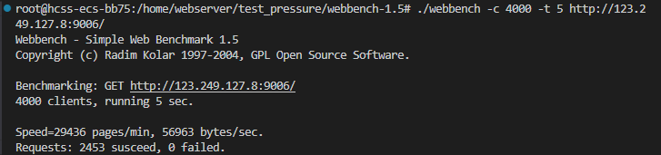
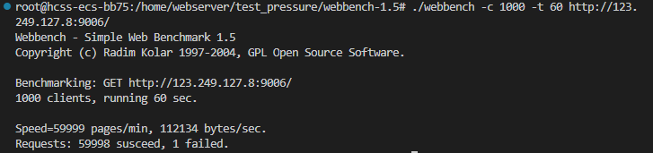

测试环境：

* `2核 | 2GiB | 系统盘 40GiB | 流量包 400GB | 峰值带宽 3Mbit/s|Ubuntu 22.04 server 64bit`

测试结果（不同`listenfd`和`connfd`模式组合）—— 可实现4000+并发，原项目是1000+并发量，因为是8G内存，这里租的服务器内存不足以支持压力测试的10000+进程数量。

* LT+ET

  

  但是：可以少进程，多时间，来测试并发量：

  

* 